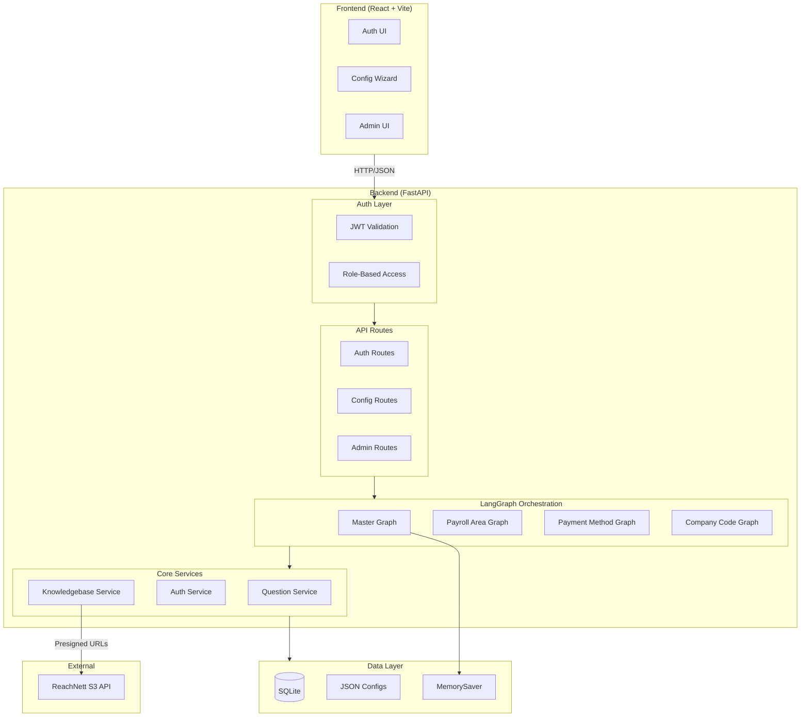

## TurboSAP Technical Reference and Context

> **Branch:** `pre-stage`

**Note on branches:** Right now we are developing along 2 main branches:
- **`pre-stage`**: Main branch with existing modules
- **`admin-config-reorg`**: New config-driven architecture in progress. Currently working on integrating into pre-stage. Testable (/admin/modules route and user /modules route)

## To Run Locally

```bash

# Terminal 1: Backend
cd backend && uvicorn app.main:app --reload --port 8000

# Terminal 2: Frontend  
npm run dev
```

- Backend: http://localhost:8000  
- Frontend: http://localhost:5173

## Deployed / Production Version

http://turbosap-py312-env.eba-5hg7r3id.us-east-2.elasticbeanstalk.com/login


---

## 1. Getting Started

### Prerequisites

| Tool | Version | Check |
|------|---------|-------|
| Python | 3.10+ | `python --version` |
| Node.js | 18+ | `node --version` |

### Installation

```bash
cd turboSAPrecent

# Backend
python3 -m venv venv
source venv/bin/activate        # Windows: .\venv\Scripts\activate
pip install -r backend/requirements.txt

# Frontend
npm install
```

### Environment Variables

**Backend** (`backend/.env`):
| Variable | Required | Default |
|----------|----------|---------|
| `JWT_SECRET` | Yes (prod) | `turbosap-secret-key-change-in-production` |
| `APP_ENV` | No | `development` |
| `OPENAI_API_KEY` | No | — (only for AI features) |
| `UPLOAD_BUCKET` | No | — (S3 bucket for tests; prod uses ReachNett API) |

**S3/Document Storage**: The app uses ReachNett's external API for S3 presigned URLs—no AWS credentials needed in TurboSAP. The presign endpoint is hardcoded to ReachNett's Lambda.

**Frontend**: No `.env` needed locally—Vite proxies `/api` to `localhost:8000`.

### Test Credentials (auto-seeded)

| Username | Password | Role |
|----------|----------|------|
| `admin123` | `admin123` | admin |
| `test123` | `test123` | client |

### Troubleshooting

| Problem | Fix |
|---------|-----|
| Database errors | `rm backend/app/turbosap.db` and restart |
| Import errors | `pip install bcrypt PyJWT python-jose[cryptography]` |

---

## 2. Architecture



### Layer Overview

| Layer | Purpose |
|-------|---------|
| **Frontend** | React UI for auth, config wizards, admin |
| **Auth** | JWT validation, role-based access (admin/client) |
| **API Routes** | HTTP endpoints grouped by domain |
| **LangGraph** | Master graph orchestrates module-specific Q&A flows | **To Change**
| **Services** | Business logic (questions, auth, knowledgebase) |
| **Data** | SQLite for users/sessions, JSON for questions, MemorySaver for active sessions |
| **External** | ReachNett API for S3 presigned URLs |

> **Note**: The 3 existing modules use LangGraph with Python-based routing. New modules (on `admin-config-reorg`) will use a config-driven GenericModuleRunner with JSON `showIf` conditions.


---

## 3. API Reference

### Auth

```bash
# Get token
TOKEN=$(curl -s -X POST http://localhost:8000/api/auth/login \
  -H "Content-Type: application/json" \
  -d '{"username":"admin123","password":"admin123"}' | jq -r '.token')

# Use token
curl -H "Authorization: Bearer $TOKEN" http://localhost:8000/api/auth/me
```

| Method | Path | Auth | Purpose |
|--------|------|------|---------|
| POST | `/api/auth/login` | — | Get JWT (7-day expiry) |
| GET | `/api/auth/me` | User | Validate token |

### Session Flow (Payroll Area) [OLD- to be modified]

| Method | Path | Auth | Purpose |
|--------|------|------|---------|
| POST | `/api/start` | User | Start session, get first question |
| POST | `/api/answer` | User | Submit answer, get next question |
| GET | `/api/session/{id}` | User | Get session state |
| POST | `/api/sessions/save` | User | Persist to database |

```bash
# Start session
curl -X POST http://localhost:8000/api/start \
  -H "Authorization: Bearer $TOKEN"

# Submit answer
curl -X POST http://localhost:8000/api/answer \
  -H "Authorization: Bearer $TOKEN" \
  -H "Content-Type: application/json" \
  -d '{"session_id": "...", "question_id": "q1_frequencies", "value": ["weekly"]}'
```

### Session Flow (Payment Method) [OLD- to be modified]

| Method | Path | Auth | Purpose |
|--------|------|------|---------|
| POST | `/api/session/payment_method/start` | User | Start payment session |
| POST | `/api/session/payment_method/answer` | User | Submit answer |

### Config Management (Admin) [NEW!! see `admin-config-reorg`]

| Method | Path | Auth | Purpose |
|--------|------|------|---------|
| GET | `/api/config/modules/{slug}/questions` | User | Get questions |
| PUT | `/api/config/modules/{slug}/questions` | Admin | Update questions |

### Hierarchy

| Method | Path | Auth | Purpose |
|--------|------|------|---------|
| GET | `/api/hierarchy` | User | Get category/task tree |
| POST | `/api/hierarchy/categories` | Admin | Create category |
| POST | `/api/hierarchy/tasks` | Admin | Create task |

### Admin

| Method | Path | Auth | Purpose |
|--------|------|------|---------|
| GET | `/api/admin/users` | Admin | List users |
| POST | `/api/admin/users` | Admin | Create user |
| PUT | `/api/admin/users/{id}/reset-password` | Admin | Reset password |

### Knowledgebase / S3

| Method | Path | Auth | Purpose |
|--------|------|------|---------|
| POST | `/api/knowledgebase/presign` | User | Get presigned URL for S3 upload |
| GET | `/api/knowledgebase/documents` | User | List uploaded documents |
| DELETE | `/api/knowledgebase/documents/{id}` | Admin | Delete document |

The presign endpoint returns a URL from ReachNett's S3 API—upload directly to that URL from the frontend.

---

## 4. Key Patterns

### LangGraph Session Management (Current)

> **Note**: This pattern is used by the 3 existing modules. New modules will use GenericModuleRunner (see `admin-config-reorg` branch).

Sessions are orchestrated by a master graph that delegates to module graphs:

```
Master Graph
    ├── payroll_area → Payroll Area Graph
    ├── payment_method → Payment Method Graph
    └── company_code → Company Code Graph
```

- **Active sessions**: Stored in memory (MemorySaver) — fast but volatile
- **Saved sessions**: Persisted to SQLite via `/api/sessions/save`
- **On server restart**: Active sessions are lost

### Question Routing (Current)

Routing logic lives in Python, not JSON. See for example `payroll_area_graph.py`

**Implication**: Adding new questions to existing modules requires code changes, not just JSON edits.

### Branch Comparison

| Aspect | `pre-stage` (current) | `admin-config-reorg` (in progress) |
|--------|----------------------|-----------------------------------|
| Session endpoints | `/api/start`, `/api/answer` | `/api/modules/{slug}/sessions` |
| Question routing | Hardcoded Python | JSON `showIf` conditions |
| Module execution | Module-specific LangGraph | GenericModuleRunner |
| Adding modules | Write Python code | Create via admin UI |

### Storage

| Data | Storage | Location |
|------|---------|----------|
| Users | SQLite | `backend/app/turbosap.db` |
| Saved sessions | SQLite | `sessions` table |
| Hierarchy | SQLite | `categories`, `tasks` tables |
| Payroll questions | JSON | `backend/app/config/questions_current.json` |
| Payment questions | JSON | `backend/app/data/payment_method_questions.json` |
| Active sessions | Memory | LangGraph MemorySaver |
| Documents | S3 (via ReachNett) | External |

--

### Key Files

| What | Where |
|------|-------|
| Backend entry | `backend/app/main.py` |
| Master graph | `backend/app/agents/graph.py` |
| Payroll graph | `backend/app/agents/payroll/payroll_area_graph.py` |
| Payment graph | `backend/app/agents/payments/payment_method_graph.py` |
| Company code graph | `backend/app/agents/` (check structure) |
| Payroll questions | `backend/app/config/questions_current.json` |
| Payment questions | `backend/app/data/payment_method_questions.json` |
| Knowledgebase service | `backend/app/services/knowledgebase.py` |
| Frontend entry | `src/App.tsx` |
| API clients | `src/api/` |

### Typical Flow

```
POST /api/start           → { session_id, question }
POST /api/answer          → { next_question } or { done: true, payroll_areas: [...] }
POST /api/sessions/save   → Persist to DB (optional)
```

### Data Flow Example: Configuration Session

```
1. LOGIN
   Frontend → POST /api/auth/login → Auth Service → JWT Token → Frontend

2. START SESSION  
   Frontend → POST /api/start → Master Graph → Payroll Graph → Question 1 → Frontend

3. ANSWER LOOP
   Frontend → POST /api/answer {answer} → Payroll Graph → Question Service 
   → Determine Next Question → Frontend
   (repeat until done)

4. GENERATE OUTPUT
   All questions answered → Payroll Graph processes answers 
   → Generates payroll area configs → Returns to Frontend

5. SAVE (optional)
   Frontend → POST /api/sessions/save → SQLite → Session persisted
```


## 5. Directory Structure

```
turboSAPrecent/
├── backend/
│   └── app/
│       ├── main.py                 # FastAPI app + most endpoints
│       ├── auth.py                 # JWT handling
│       ├── middleware.py           # Auth decorators
│       ├── database.py             # SQLite operations
│       │
│       ├── agents/                 # LangGraph graphs
│       │   ├── graph.py            # Master orchestrator
│       │   ├── payroll/
│       │   │   └── payroll_area_graph.py
│       │   └── payments/
│       │       └── payment_method_graph.py
│       │
│       ├── routes/                 # Additional API routers
│       │   ├── module_config.py    # Question management
│       │   ├── hierarchy.py        # Category/task CRUD
│       │   └── export_api.py       # SAP file export
│       │
│       ├── config/                 # Payroll question configs
│       │   ├── questions_current.json
│       │   ├── questions_original.json
│       │   └── questions_backup.json
│       │
│       └── data/                   # Other configs
│           ├── payment_method_questions.json
│           ├── modules_metadata.json
│           └── hierarchy.json
│
└── src/                            # React frontend
    ├── App.tsx                     # Router + auth
    ├── api/                        # API client functions
    ├── store/                      # Zustand stores
    ├── components/
    └── pages/
        └── admin/
```


